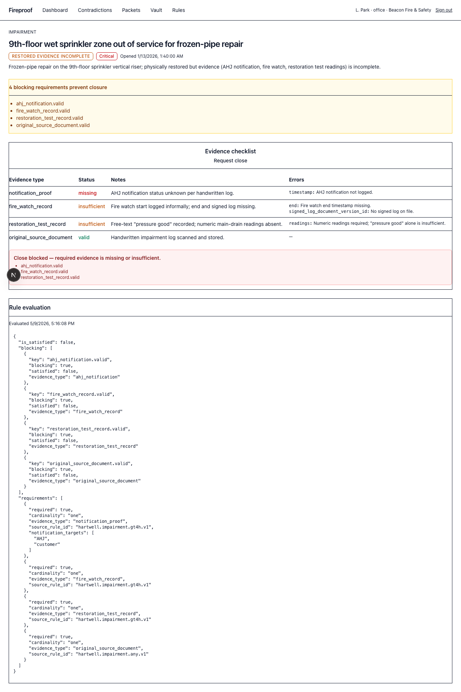
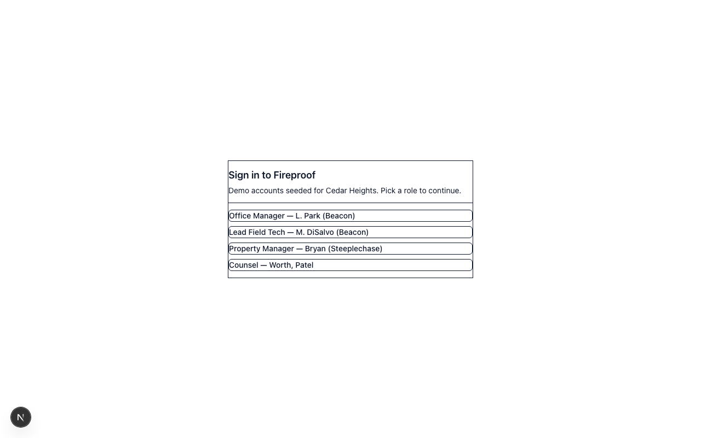
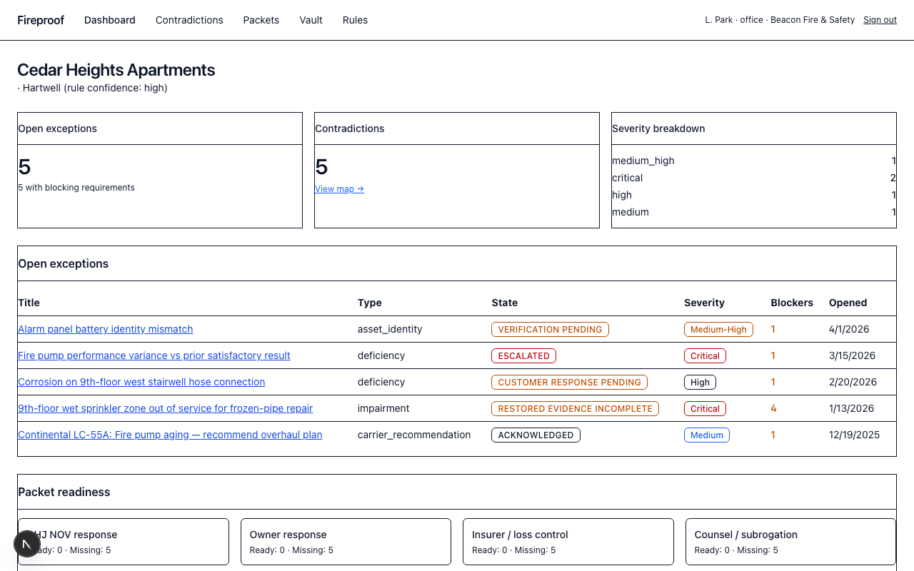
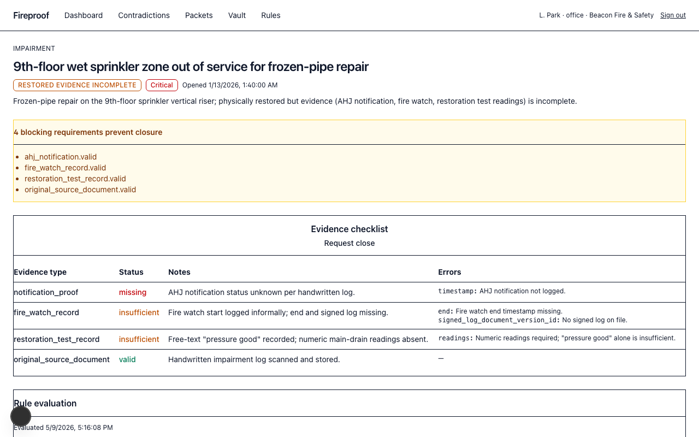
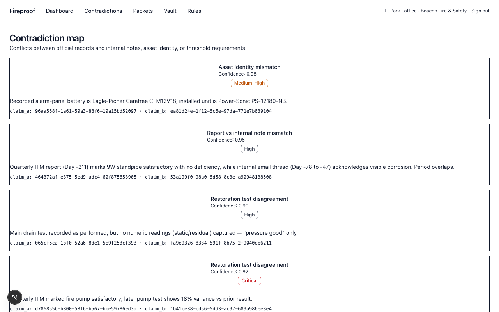
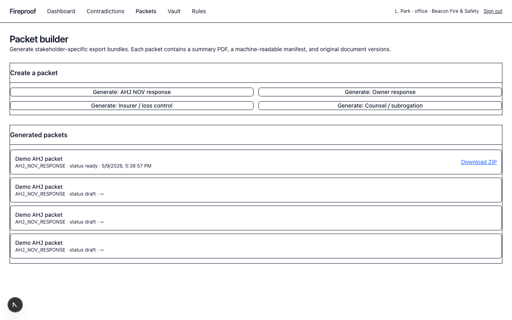
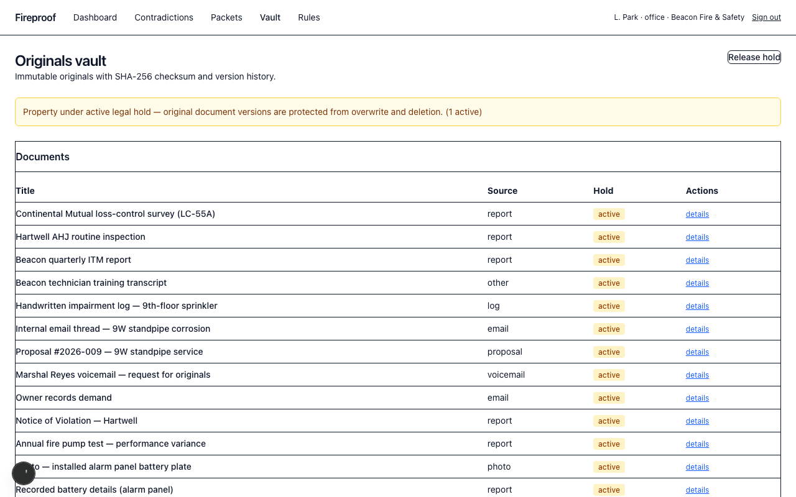

# Fireproof — demo screenshots

Captured by `apps/web/scripts/capture.ts` against the local stack
(API on `:4000`, Next.js on `:3000`, Postgres seeded with the Cedar
Heights demo). Viewport: 1280×800, light theme, headless Chromium.

The flow follows `docs/DEMO.md` step-for-step.

---

## 00 · Hero



The Day-116 sprinkler impairment after the office manager attempts to
close it. Four blocking requirements, three of them missing/insufficient,
one valid. This is the wedge: routine ITM software lets you check a box
and move on. Fireproof refuses.

---

## 01 · Login



Dev login. Four seeded users — Office Manager, Field Tech, Property
Manager, Counsel — exposed as a tile picker. Selecting L. Park (Office
Manager, Beacon Fire & Safety) routes to the Cedar Heights dashboard.

---

## 02 · Property dashboard



Five open exceptions, five auto-detected contradictions, severity
breakdown, and packet-readiness across the four stakeholder packet
types. The Day-116 impairment shows **4 blockers** — the highest count
on the property, and the entry point for the demo.

---

## 03 · Exception detail (initial)



The 9th-floor sprinkler impairment as it stands today: state =
`restored_evidence_incomplete`, severity `critical`, opened
`Day −116 07:40`. Rule pack `hartwell_v1` (high confidence) applied;
required evidence types listed with their statuses. The
`restoration_test_record` row already calls out the failure mode:
*"Free-text 'pressure good' recorded; numeric main-drain readings
absent."*

---

## 04 · Close blocked (HTTP 422)


Office manager clicks **Request close**. The API returns:

```json
HTTP 422 BLOCKING_REQUIREMENTS_UNMET
{
  "details": {
    "unmet": [
      "ahj_notification.valid",
      "fire_watch_record.valid",
      "restoration_test_record.valid"
    ]
  }
}
```

The blocking-requirements alert refuses closure until the rule-pack
gates clear. This is exactly what was missing from Beacon's records on
Day +12 when Marshal Reyes asked for them.

---

## 05 · Contradiction map



Five Cedar Heights contradictions, deterministically detected from
seeded document claims:

1. **Asset identity mismatch** — recorded battery is Eagle-Picher
   Carefree CFM12V18; installed unit is Power-Sonic PS-12180-NB.
2. **Report vs internal note mismatch** — Quarterly ITM marks 9W
   standpipe satisfactory while the internal email thread acknowledges
   visible corrosion. Periods overlap.
3. **Restoration test disagreement (high)** — main drain test recorded
   as performed, no numeric readings.
4. **Restoration test disagreement (critical)** — pump performance
   variance vs prior satisfactory result.
5. *(off-screen)* AHJ notification gap on the 350-minute impairment.

---

## 06 · Packet builder — AHJ NOV response ready



One click on **Generate: AHJ NOV response** runs the full packet
pipeline synchronously: gather scoped exceptions + documents +
contradictions + audit events, build the manifest, render the summary
PDF, render the export receipt PDF, archive into a ZIP, hash the
artifact, and persist a `packets` row plus per-document `packet_items`.
Status flips to `ready`; reviewer can download the ZIP directly.

The repeated draft entries are an artifact of running the capture
script multiple times without a reset.

---

## 07 · Vault — legal hold active



Counsel applies a property-scope legal hold. The banner surfaces it
property-wide; every document version inherits hold status. Beneath the
surface, the `DocumentService.createVersion` and `deleteVersion` paths
now refuse to overwrite or delete any `is_original = true` row scoped
under the hold, returning `LEGAL_HOLD_ACTIVE` (HTTP 423). This is the
"give me originals" requirement from Marshal Reyes's voicemail and
from Worth, Patel's preservation hold demand, expressed as a hard
runtime constraint.
